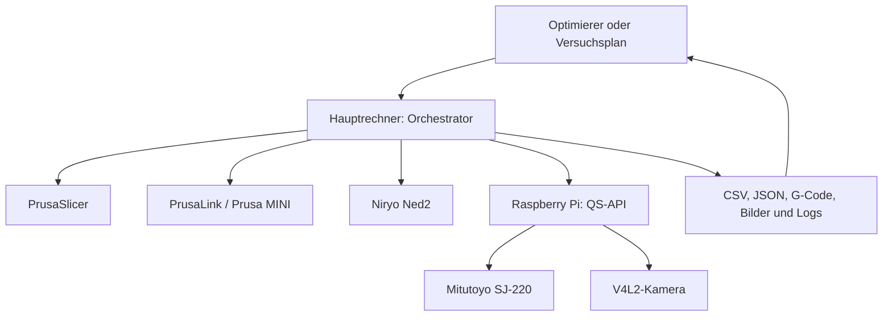
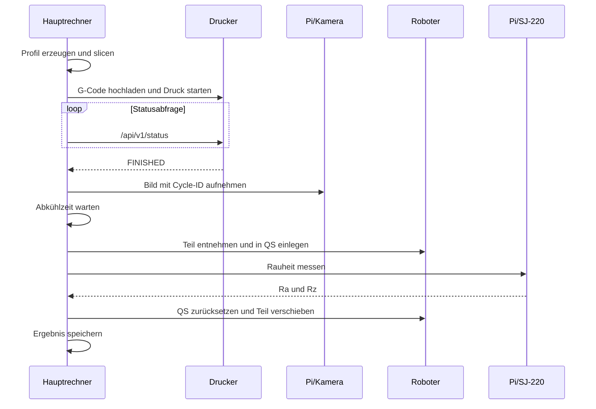
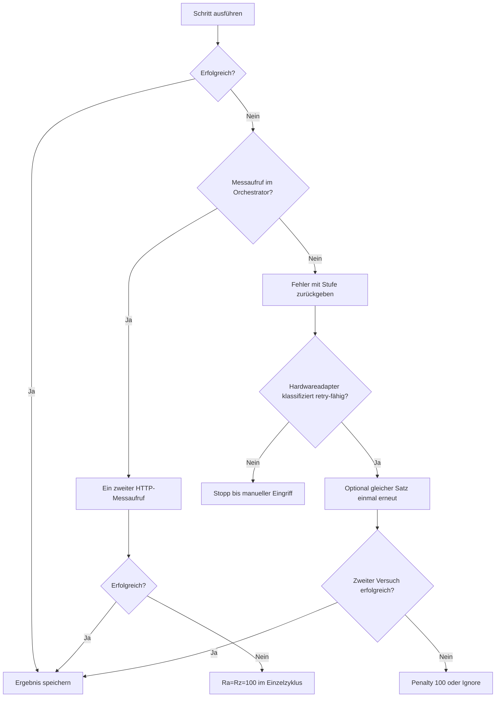

# 01 – Systemüberblick

## Zweck und Abgrenzung

Automated R.E.P.P.R.I.N.T. untersucht, wie sich Prozessparameter eines FFF-Drucks auf die Oberflächenrauheit auswirken. Das System erzeugt Testkörper, transportiert sie automatisiert zu einer Qualitätsstation und erfasst dort `Ra` und `Rz`. Ein Optimierer kann den Messwert `Ra_um` anschließend als Zielfunktion verwenden und den nächsten Parametersatz vorschlagen.

Der aktuelle Code automatisiert diesen Kreis technisch. Eine wissenschaftliche Bewertung der Druckqualität, eine Modellvalidierung und ein Vergleich verschiedener Regressionsmodelle sind nicht Bestandteil des implementierten Laufzeitpfads. Auch eine Bildauswertung ist nicht implementiert; die Kamera dokumentiert nur den Zustand des Druckteils.

## Verteilung auf die Geräte

| Ort | Software | Angeschlossene beziehungsweise angesprochene Hardware |
| --- | --- | --- |
| Hauptrechner | `main.py`, `PrintOrchestrator`, Slicer-, Drucker-, Roboter- und API-Clients, Versuchsplan, Ergebnis-CSV, Optimierer | Prusa-Drucker und Niryo Ned2 über LAN; Raspberry Pi über HTTP |
| Raspberry Pi 5 | FastAPI-Anwendung `qs.api`, `SJ220Service`, Kamera-Funktionen aus `camera_ctrl` | Mitutoyo SJ-220 an `/dev/ttyUSB0`; Kamera standardmäßig an `/dev/video0` |
| Prusa MINI/MINI+ | PrusaLink und Drucker-Firmware | USB-Datenträger des Druckers, Druckmechanik |
| Niryo Ned2 | Roboter-Firmware | Greifer und mechanische Übergabe zwischen Drucker und QS-Station |
| QS-Station | Mechanik plus SJ-220 | Taster, Hebel und Bauteilaufnahme |

## Gesamtarchitektur

Die Kommunikation ist nicht ereignisgetrieben. Der Hauptrechner ruft alle Schritte synchron auf und wartet auf das jeweilige Ergebnis:

- PrusaLink: HTTP mit `X-Api-Key`.
- QS und Kamera: HTTP/JSON ohne im Repository implementierte Authentifizierung.
- Roboter: PyNiryo über die konfigurierte Roboter-IP.
- SJ-220: serielle Kommandos über den Raspberry Pi.
- Kamera: `v4l2-ctl` und `ffmpeg` als lokale Prozesse auf dem Raspberry Pi.

## Ablauf eines vollständigen Zyklus

Die Reihenfolge folgt `PrintOrchestrator._run_cycle()` in `src/orchestrator.py`, aufgerufen über die beiden öffentlichen Zyklusmethoden. Sie weicht von älteren Konzepttexten ab: Das Kamerabild entsteht nach dem Druck und **vor** Abkühlung, Robotertransport und Messung.

Die internen Stufen heißen:

1. `preflight`
2. `slicing`
3. `uploading`
4. `starting_print`
5. `waiting_for_print`
6. `camera_capture`
7. `cooling`
8. `robot_handling`
9. `measuring`
10. `recording`
11. `completed`

Ein `robot-qs`-Zyklus überspringt Slicing, Drucker, Kamera und Abkühlzeit. Er erwartet bereits ein geeignetes Bauteil im Druckerbereich. Der Modus `preflight` bewegt keine Hardware; beim Programmeinstieg wird davor jedoch ein abgeleitetes Slicer-Profil erzeugt.

## Zwei Steuerpfade

### Statischer Versuchsplan

`python -m main --mode experiment` liest genau 100 validierte Parametersätze aus einer CSV. Ohne `--reuse-experiment-plan` wird vor dem Lauf ein neuer Latin-Hypercube-Plan erzeugt und eine vorhandene Plandatei archiviert. Der Benutzer wählt über Start- und Endnummer den auszuführenden Bereich. Die Wiederaufnahme ist manuell und nicht aus der Ergebnis-CSV abgeleitet.

### Adaptiver Optimierer

`optimizer.hardware_cli` verwendet `ExperimentStore`. Jeder Vorschlag und jeder Zustandswechsel wird vor beziehungsweise nach dem physischen Schritt atomar gespeichert. Nach dem Warmstart erzeugt die konfigurierte Strategie neue Vorschläge aus den verwertbaren Beobachtungen. `optimizer.framework_runner` nutzt denselben Zustandsmechanismus mit einem deterministischen Simulator statt Hardware.

## Daten- und Kontrollfluss

| Eingabe | Verarbeitung | Ergebnis |
| --- | --- | --- |
| STL und Basisprofil | `SlicerProfileGenerator` ersetzt sechs relevante Slicer-Werte | zyklusspezifisches INI-Profil |
| INI-Profil und STL | `SlicerService` ruft PrusaSlicer auf | G-Code/BG-Code-Pfad |
| G-Code | `PrusaLinkService` lädt hoch und beobachtet den Druckstatus | Start-/Endstatus |
| Cycle-ID | `CameraClient` stößt Aufnahme an und lädt sie herunter | JPEG auf Hauptrechner und Pi |
| Roboterpositionen | `RobotService` führt eine feste Bewegungsfolge aus | Teil unter dem Taster |
| HTTP-Messauftrag | `SJ220Service` führt das serielle Protokoll aus | `Ra_um`, `Rz_um` |
| Ergebnis | `CsvCycleRecorder` oder `ExperimentStore` | CSV/JSON, Optimiererbeobachtung |

Die statische und die adaptive Ausführung benutzen denselben `PrintOrchestrator`. Sie unterscheiden sich vor allem darin, wie Parameter vorgeschlagen und Ergebnisse persistiert werden.

## Fehler, Wiederholung und Abbruch

Wichtige Grenzen dieser Logik:

- Der Einzelzyklus behandelt zwei fehlgeschlagene QS-HTTP-Aufrufe als abgeschlossenes Ergebnis mit `Ra=Rz=100`; die nachgelagerte Roboterbewegung wird trotzdem ausgeführt.
- Das SJ-220 führt beim Gerätefehler `007` intern bereits eine zusätzliche Messbewegung aus und meldet danach weiterhin einen Fehler. Zusammen mit dem zweiten HTTP-Aufruf des Orchestrators können daher mehr als zwei physische Messbewegungen entstehen.
- Im Optimierer-Hardwareadapter gelten Fehler in `waiting_for_print` oder `measuring` als physisch verbrauchte, retry-fähige Versuche. Zwei Fehlschläge werden je nach Experimententscheidung als Penalty `100` oder als ignorierte Beobachtung gespeichert.
- Upload-, Kamera-, Roboter-, Recording- und unbekannte Fehler erfordern einen manuellen Stopp. Nach drei aufeinanderfolgenden endgültig fehlgeschlagenen Parametersätzen wird zusätzlich eine Sicherheitsquittierung verlangt.

Die vollständige Matrix steht in [09 – Fehlerbehandlung](09_fehlerbehandlung.md).

## Verifizierungsstatus

| Aussage | Status |
| --- | --- |
| Programmstruktur, Parameterfluss und Fehlerklassifikation | Im Code nachvollzogen |
| CLI-Parser, Konfigurationsprüfung, Warmstart, Simulation | In der bereitgestellten Umgebung ausgeführt |
| Unit-/Integrationstests | 129 erfolgreich, 1 veralteter Importfehler |
| Echte Druck-, Roboter-, Kamera- und Messbewegung | In dieser Dokumentationsrunde nicht ausgeführt |
| Physische Positionen und mechanische Toleranzen | Aus Code abgeleitet; vor Ort erneut zu validieren |

Weiter: [02 – Repository und Architektur](02_repository_und_architektur.md)
