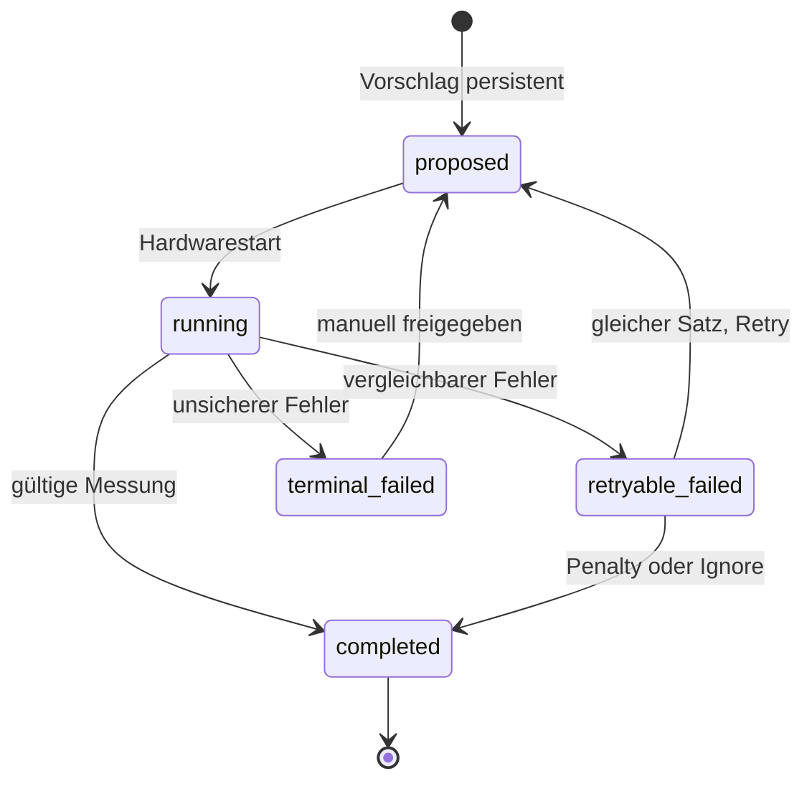
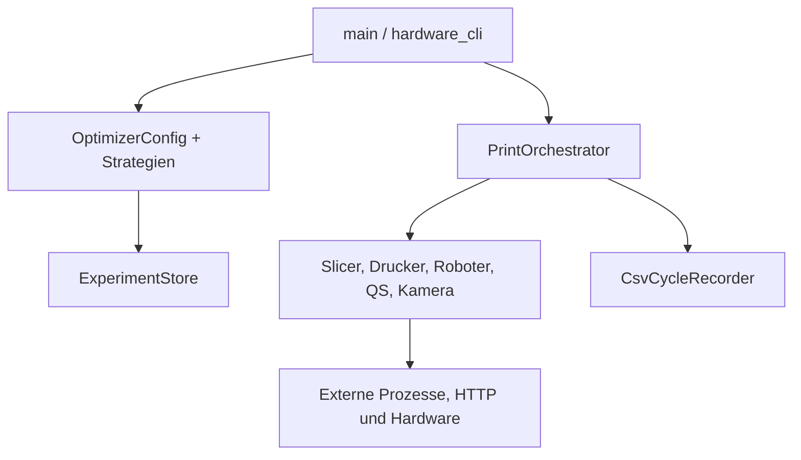

# 02 – Repository und Architektur

## Relevante Struktur

```text
bachelor-3d-loop/
├── README.md
├── requirements.txt                 # ältere Root-Abhängigkeitsliste
└── 3d-automation/
    ├── config/                      # Env-Beispiel, Slicer- und Optimierer-Konfigurationen
    ├── data/                        # STL, Pläne und vorhandene Laufartefakte
    ├── docs/                        # Übergabe- und historische Meilenstein-Dokumentation
    ├── scripts/                     # Windows-Setup-Skript
    ├── src/                         # Anwendungscode
    ├── tests/                       # unittest-Testmodule
    └── requirements.txt             # Laufzeitabhängigkeiten, derzeit unvollständig
```

Generierte Verzeichnisse wie `__pycache__`, `.venv`, `data/camera_images`, G-Code und Optimierungsläufe sind keine Quelle für die Architektur. Sie dürfen für Diagnosezwecke wichtig sein, sollen aber nicht manuell als Programmzustand editiert werden.

## Einstiegspunkte

Alle Modulaufrufe erfolgen aus `3d-automation/` mit `PYTHONPATH="$PWD/src"`.

| Einstieg | Zweck | Quellcode |
| --- | --- | --- |
| `python -m main` | Preflight, Robot-QS, Einzelzyklus, statischer Versuchsplan | `src/main.py:main` |
| `python -m optimizer.config` | Optimierer-JSON validieren und anzeigen | `src/optimizer/config.py:main` |
| `python -m optimizer.warm_start` | deterministischen Warmstart anzeigen | `src/optimizer/warm_start.py:main` |
| `python -m optimizer.framework_runner` | hardwarefreie Optimierersimulation | `src/optimizer/framework_runner.py:main` |
| `python -m optimizer.hardware_cli` | sicherheitsbegrenzter Optimierer-Hardwarelauf | `src/optimizer/hardware_cli.py:main` |
| `python -m qs.api` | nicht als eigener CLI-Start implementiert; Server wird mit Uvicorn gestartet | `src/qs/api.py:app` |
| `python -m qs.run_sj220` | direkte SJ-220-Messung auf dem Pi | `src/qs/run_sj220.py` |
| – | Für `camera.camera_ctrl` existiert kein eigener CLI-Einstieg; Aufnahmen erfolgen über die API | `src/camera/camera_ctrl.py:capture_still` |
| `python -m robot.robot_service` | direkte Roboterdiagnose; bewegt reale Hardware | `src/robot/robot_service.py` |

## Module und Verantwortlichkeiten

### Orchestrierung und Parameter

| Datei | Zentrale Typen/Funktionen | Verantwortung |
| --- | --- | --- |
| `src/main.py` | `parse_arguments`, `build_orchestrator`, `main` | CLI, Env-Auswertung, Objekterzeugung, Moduswahl |
| `src/orchestrator.py` | `CycleRequest`, `CycleResult`, `CycleStage`, `run_single_print_cycle`, `run_handling_and_measurement_cycle` | genau einen begrenzten Prozesszyklus ausführen |
| `src/printer/print_parameters.py` | `PrintParameters`, `SlicerProfileGenerator.generate` | Parameter validieren und Basisprofil ableiten |
| `src/printer/slicer_service.py` | `SlicerService.send_stl_to_slicer` | PrusaSlicer-Prozess mit Timeout starten |
| `src/printer/prusalink_service.py` | `PrusaLinkService` | Upload, Start und Statusüberwachung per HTTP |

### Hardware und QS

| Datei | Zentrale Typen/Funktionen | Verantwortung |
| --- | --- | --- |
| `src/robot/robot_service.py` | `RobotService`, `prepare_part_for_measurement`, `complete_part_handling_after_measurement` | feste Greif-, Transfer- und QS-Bewegungen |
| `src/robot/robot_positions.py` | benannte `RobotPosition`-Konstanten | sechsachsige Gelenkpositionen und Zwecktexte |
| `src/qs/api.py` | FastAPI-`app` und Routenfunktionen | HTTP-Fassade für Messung und Kamera |
| `src/qs/sj220_service.py` | `SJ220Service` | serielles Protokoll, Statusabfrage, Messwertlesen |
| `src/qs/sj220_models.py` | Status- und Ergebnisdatentypen | Geräteantworten typisieren |
| `src/qs/sj220_exceptions.py` | SJ-spezifische Exceptions | Fehler auf API-Statuscodes abbildbar machen |
| `src/qs/qs_api_client.py` | `QualityStationClient` | Health- und Mess-HTTP-Aufrufe vom Hauptrechner |
| `src/camera/camera_ctrl.py` | `capture_still`, `show_live` | V4L2-Steuerung, ffmpeg-Aufnahme, Livebild |
| `src/camera/camera_client.py` | `CameraClient` | Pi-Aufnahme anstoßen und JPEG herunterladen |

### Versuchsplan, Ergebnisse und Optimierer

| Datei | Zentrale Typen/Funktionen | Verantwortung |
| --- | --- | --- |
| `src/experiments/experiment_plan.py` | `ExperimentPlanEntry`, `generate_experiment_plan`, `load_experiment_plan` | statische 100-Punkte-LHS-Datei erzeugen/validieren |
| `src/experiments/experiment_runner.py` | `ExperimentRunner.run` | ausgewählten Bereich eines Plans seriell ausführen |
| `src/results/csv_cycle_recorder.py` | `CsvCycleRecorder.record` | Ergebniszeilen anhängen und auf Datenträger synchronisieren |
| `src/optimizer/config.py` | `OptimizerConfig`, `load_optimizer_config` | JSON-Schema, Grenzen und Pfade validieren |
| `src/optimizer/warm_start.py` | `WarmStartGenerator`, `propose_next` | LHS-, Random- oder Sobol-Warmstart erzeugen |
| `src/optimizer/strategies.py` | Strategieklassen und `build_strategy` | adaptive oder batchweise Folgevorschläge |
| `src/optimizer/experiment_store.py` | `ExperimentStore`, `RunRecord`, `ExperimentState` | transaktionale Laufpersistenz und Resume-Regeln |
| `src/optimizer/framework_runner.py` | `FrameworkRunner`, `SyntheticSurfaceExecutor` | Simulation und gemeinsame Optimierersteuerung |
| `src/optimizer/hardware_executor.py` | `OrchestratorRunExecutor` | Optimierer-Vorschlag in einen Orchestratorlauf übersetzen |
| `src/optimizer/hardware_cli.py` | CLI-Steuerung und Sicherheitsgates | Preflight, Bestätigung, Retry und manuelle Freigabe |

## Zentrale Datenmodelle

### Einzelzyklus

`CycleRequest` verbindet eine `cycle_id`, den Modus, STL-, Profil- und G-Code-Pfade sowie ein `PrintParameters`-Objekt. `CycleResult` enthält Status, letzte Stufe, Zeitpunkte, Pfade, Druckerzustände, Bildpfad, `Ra_um`, `Rz_um` und gegebenenfalls eine Fehlermeldung. Der statische Recorder flacht dieses Objekt in eine CSV-Zeile ab.

Die Cycle-ID wird als UUID erzeugt. Der Kamera-Endpunkt akzeptiert deren hexadezimale Darstellung ohne Bindestriche (`uuid.hex`, 32 Kleinbuchstaben/Ziffern).

### Optimiererzustand

`ExperimentState` hält Gesamtzahl, Zahl abgeschlossener Läufe, aktuelle Run-Nummer und Pauseninformationen. Der Status jedes einzelnen geplanten, laufenden oder abgeschlossenen Satzes steht im jeweiligen `RunRecord`; dieser enthält außerdem Parameter, Strategie, Optimiereriteration, Attempt-Zähler und Ergebnis. Der Store schreibt getrennte JSON-Dateien und baut daraus `results.csv` neu auf.



`running` ist ein persistenter Status, für den die aktuelle CLI nach einem Prozessabbruch keinen expliziten Wiederherstellungsbefehl anbietet. Dies ist kein erlaubter manueller JSON-Edit, sondern ein offener Implementierungspunkt.

## Modulabhängigkeiten



Die Hardwareklassen sind im Orchestrator über kleine Protocol-Schnittstellen entkoppelt. Dadurch ersetzen die Tests Slicer, Drucker, Roboter, QS und Kamera durch Fakes, ohne reale Geräte anzusprechen. Das Optimierer-Framework kapselt die Ausführung zusätzlich über einen Executor: `SyntheticSurfaceExecutor` für Simulation und `OrchestratorRunExecutor` für den realen Orchestrator.

## Zuständigkeit der Persistenz

Es existieren zwei bewusst getrennte Speicherwege:

- `CsvCycleRecorder`: append-only CSV für `main --mode full|robot-qs|experiment`; kennt keine Optimiereriteration oder Attempt-Nummer.
- `ExperimentStore`: JSON-Zustand plus atomar neu erzeugte CSV für den Optimierer; kennt Retry, Penalty, Ignore und Strategie-Checkpoint.

Eine statische Ergebnis-CSV kann deshalb nicht direkt als Optimiererzustand fortgesetzt werden. `paths.history_csvs` wird zwar vom Konfigurationsschema akzeptiert, die aktuellen Runner lehnen eine nicht leere Historienliste aber ausdrücklich ab.

## Architekturrelevante Altdateien

Die Dateien `docs/OPTIMIZER_FRAMEWORK_STEP_*.md`, `docs/END_TO_END_SINGLE_CYCLE.md`, `docs/robot_positions.md`, `src/docs/ROBOT_POSITIONS.md` und `src/robot/generate_position_docs.py` dokumentieren Zwischenstände. Insbesondere Fehler-Retries und Robotersequenzen stimmen dort teilweise nicht mehr mit `src/orchestrator.py` beziehungsweise `src/robot/robot_service.py` überein. Für Änderungen gilt der aktuelle Code als Quelle.

Weiter: [03 – Installation](03_installation.md)
