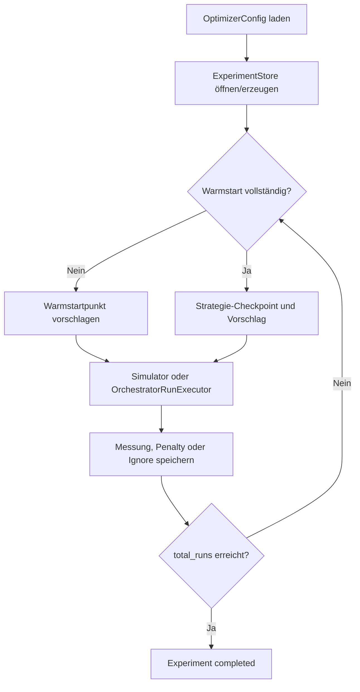

# 08 – Optimierer

## Ziel und Umfang

Der Optimierer minimiert ausschließlich `Ra_um`, die arithmetische Mittenrauheit in Mikrometern. `Rz_um` wird gespeichert, aber nicht zur Auswahl des nächsten Punkts verwendet. Der Optimierer steuert sechs logische Druckparameter; jeder davon ist in der JSON entweder variabel oder fest.

Der aktuelle Stand enthält ein integriertes, persistentes Vorschlags- und Hardwareframework. Nicht implementiert sind Import historischer CSV-Daten, QBC (Query by Committee), Mehrzieloptimierung, automatische Bildauswertung und der im frühen Projektpitch skizzierte Vergleich von kNN, SVR, LightGBM, CatBoost oder MLP.

## Prozess

Wesentlich für Crash-Sicherheit: Ein Vorschlag wird vor seiner Ausführung in `runs/` gespeichert. Ein Strategiebatch wird ebenfalls vor Hardwarekontakt im `optimizer_state/` festgeschrieben.

## Parameterraum

`ParameterSpace` transformiert jede variable Dimension linear auf `[0,1]`. Strategien rechnen nur in diesem normierten Raum. Danach wird auf die reale Grenze zurückskaliert und gemäß Parametertyp quantisiert:

| Parameter | Quantisierung | intrinsische Domäne |
| --- | --- | --- |
| `top_solid_layers` | ganze Zahl | >= 0 |
| `print_speed` | 0,1 mm/s | > 0 |
| `extrusion_width` | 0,001 mm | > 0 |
| `extrusion_multiplier` | 0,001 | > 0 |
| `temperature` | ganze °C | >= 0 |
| `fan_speed` | ganzes Prozent | 0…100 |

Die tatsächlichen Experimentgrenzen kommen vollständig aus JSON. Diese weiten Code-Domänen ersetzen keine sichere Druckparameterfreigabe.

## Warmstart

Ein Warmstart ist ein vorab erzeugtes Initialdesign. Erst nach dessen vollständiger Messung startet die Hauptstrategie. `WarmStartGenerator` verwendet NumPy und `scipy.stats.qmc`.

| Methode | Implementierung | Eigenschaft |
| --- | --- | --- |
| `lhs` | `qmc.LatinHypercube` | stratifiziert jede Dimension |
| `random` | `numpy.random.default_rng` | unabhängige Pseudozufallswerte |
| `sobol` | gescrambelte `qmc.Sobol`-Sequenz | niedrig-diskrepante Punktverteilung; intern auf Zweierpotenz erzeugt und gekürzt |

Alle Methoden sind mit `seed` deterministisch. Nach Skalierung und Rundung werden Duplikate entfernt. Reicht der quantisierte Raum nicht aus, bricht die Generierung ab. Maximal 100 Generierungsbatches werden versucht.

Mit `config/optimizer_config.example.json` ergab die verifizierte Vorschau unter anderem als ersten Punkt `top_solid_layers=5`, `print_speed=50.9`, `extrusion_width=0.459`, `extrusion_multiplier=1.052`, `temperature=226`, `fan_speed=45`; derselbe Seed erzeugt dieselbe Folge.

### `WarmStartGenerator.propose_next(store)`

**Eingabe:** ein validierter `ExperimentStore`, dessen Konfiguration zur Generatorinstanz gehört.

**Ausgabe:** ein persistierter `RunRecord`.

Interner Ablauf:

1. Den gesamten deterministischen Warmstart aus Konfiguration und Seed erneut erzeugen.
2. `store.next_run_number()` bestimmen.
3. Abbrechen, wenn das Experiment fertig ist oder die Nummer schon außerhalb der Warmstartphase liegt.
4. Über `load_resume_run()` prüfen, ob dieser Run bereits persistiert ist; dann exakt ihn zurückgeben.
5. Sonst Punkt `run_number - 1` auswählen.
6. Mit `store.propose_run(...)` **vor** der Ausführung speichern; `optimizer_iteration` bleibt `null`.

Die Methode misst nicht, erzeugt keinen G-Code und kontaktiert keine Hardware.

## Verfügbare Hauptstrategien

| Strategie | Batchgröße | Zustand | Voraussetzung |
| --- | --- | --- | --- |
| Bayesian | 1 | GP-Metadaten und Vorschlag | mindestens 2 Beobachtungen |
| Random | Warmstartgröße | Seed je Iteration | vollständige Batch-Aufteilung |
| Sobol | Warmstartgröße | Sequenzstartindex | vollständige Batch-Aufteilung |
| PSO | Warmstartgröße = Partikelzahl | Positionen, Geschwindigkeiten, pbest, gbest, RNG | mindestens 2 Partikel |
| Differential Evolution | Warmstartgröße = Population | Population, Fitness, Trials, RNG | mindestens 4 Individuen |

PSO und Differential Evolution benötigen jeweils alle Resultate des vorherigen Batches, bevor der nächste berechnet wird. Random und Sobol erzeugen ebenfalls ganze Batches. `total_runs - warm_start.sample_count` muss deshalb für alle außer Bayesian durch die Warmstartgröße teilbar sein.

## Bayesian Optimization im Detail

Bayesian Optimization (BO) modelliert die unbekannte Beziehung zwischen Parametern und `Ra` mit einem Gaußprozess (GP). Verwendet werden scikit-learn und der Kernel

\[
k(x,x') = C \cdot \operatorname{RBF}(x,x') + \operatorname{WhiteKernel}(x,x').
\]

Der GP normalisiert `y`, verwendet den Experiment-Seed als `random_state` und führt die konfigurierte Zahl `n_restarts_optimizer` aus. Alle nicht ignorierten abgeschlossenen Beobachtungen gehen ein; Penalty-Werte sind normale Beobachtungen mit `y=100`.

### Expected Improvement

Für Minimierung berechnet der Code mit bestem bisherigen Wert \(y_\min\), GP-Mittelwert \(\mu(x)\), Unsicherheit \(\sigma(x)\) und Offset \(\xi=\max(0{,}01\,\mathrm{std}(y),10^{-9})\):

\[
I(x)=y_\min-\mu(x)-\xi,
\qquad
EI(x)=I(x)\Phi(z)+\sigma(x)\phi(z),
\qquad
z=I(x)/\sigma(x).
\]

Bei praktisch null Unsicherheit wird EI auf null gesetzt. Eine SciPy-Differential-Evolution mit `maxiter=100`, `popsize=8` sucht zunächst das EI-Maximum im Einheitswürfel. Zusätzlich erzeugt ein LHS `candidate_count` Kandidaten. Der optimierte Punkt und die LHS-Punkte werden gemeinsam nach EI absteigend sortiert.

Bei `acquisition: "thompson"` wird für jeden Kandidaten stattdessen einmal `mean + std * Normal(0,1)` gezogen und aufsteigend sortiert, weil `Ra` minimiert wird.

### Auswahl des nächsten Punkts

`ParameterSpace.unique_parameters()` nimmt den bestgerankten noch nicht beobachteten, nach Quantisierung eindeutigen Satz. Reichen die Kandidaten nicht, ergänzt es bis zu mindestens 4096 LHS-Fallbackpunkte. Genau ein Vorschlag wird als Batch und danach als Run gespeichert.

## PSO und Differential Evolution

PSO startet die Partikel an den Warmstartpositionen, initialisiert Geschwindigkeiten in `[-0.05,0.05]` und aktualisiert sie aus Trägheit, persönlichem und globalem Bestwert. Geschwindigkeit wird auf `±max_velocity` begrenzt; bei Grenztreffern wird die betroffene Komponente auf null gesetzt.

Differential Evolution verwendet die Warmstartpunkte als Population. Für jedes Individuum werden drei andere ohne Zurücklegen gewählt; Mutation ist `r1 + differential_weight * (r2-r3)`. Binomiales Crossover erzwingt mindestens eine mutierte Dimension. Nach vollständiger Trial-Messung ersetzt nur ein besserer Trial sein Zielindividuum.

Beide speichern den vollständigen RNG- und Populationszustand als JSON-Checkpoint, sodass Resume dieselbe Evolution fortsetzt.

## Eine Iteration als Beispiel

Angenommen, zehn Warmstartläufe sind abgeschlossen und Bayesian ist konfiguriert:

1. `observations_from_store()` liest die zehn Run-JSONs und lässt ignorierte Fehlschläge weg.
2. Die Parameter werden normiert; die zehn `objective_value`-Werte bilden `y`.
3. Der GP wird neu angepasst.
4. Differential Evolution und LHS erzeugen/ranken Kandidaten.
5. Der beste noch nicht beobachtete quantisierte Punkt wird in `optimizer_state/bayesian_iteration_0000.json` festgeschrieben.
6. `runs/run_0011.json` wird mit Status `proposed` angelegt.
7. Der Simulator oder Hardwareadapter führt Run 11 aus.
8. Ein gültiges `Ra` schließt den Run ab; danach kann Iteration 1 entstehen.

Bricht der Prozess zwischen Schritt 5 und 7 ab, wird beim Resume der gespeicherte Punkt geladen und nicht neu optimiert.

## Messwertübergabe und ungültige Werte

`OrchestratorRunExecutor` akzeptiert nur einen `CycleResult` mit Status und Stufe `completed`, ohne Fehlertext sowie endlichen numerischen `Ra`- und `Rz`-Werten. Ungültige Messwerte werden als retry-fähige `result_validation`-Fehler klassifiziert.

Der darunterliegende Orchestrator wandelt jedoch zwei fehlgeschlagene QS-Aufrufe bereits in `Ra=Rz=100` plus Fehlertext um. Der Adapter erkennt den Fehlertext als `measurement_penalty`; dieser Satz wird über die Framework-Policy erneut versucht beziehungsweise endgültig als Penalty/Ignore gespeichert.

## Penalty, Ignore und Abbruch

- `penalty`: Nach maximal zwei automatischen vergleichbaren Versuchen wird `objective_value=100.0` gespeichert. Der Punkt beeinflusst alle Strategien als sehr schlechte Beobachtung.
- `ignore`: Der Run zählt zu `completed_runs`, hat aber keinen Zielfunktionswert und wird aus den Beobachtungen entfernt.
- Nach drei aufeinanderfolgenden endgültig fehlgeschlagenen Parametersätzen pausiert das Experiment, bis der Operator quittiert.
- `total_runs` zählt abgeschlossene Parametersätze einschließlich Penalty und Ignore, nicht physische Attempts.

Bekannte Einschränkung: Da ignorierte Punkte aus `observations_from_store()` entfernt werden, sieht die Duplikatprüfung sie ebenfalls nicht. Eine Strategie kann denselben ignorierten Parametersatz später erneut vorschlagen. Das sollte durch eine getrennte Menge aller bereits physischen Parameter behoben werden.

## Resume und Integrität

`--resume` öffnet exakt das konfigurierte Zielverzeichnis, prüft den Snapshot-Hash und rekonstruiert den Fortschritt aus den Run-Dateien. `--from-run` bestätigt die erwartete nächste Nummer; es überspringt keine Runs. Batch-Checkpoints verhindern eine Neuauslosung.

Noch nicht unterstützt:

- Import über nicht leere `paths.history_csvs`;
- CLI-Klassifikation eines nach Crash verbleibenden `running`-Runs;
- Ändern der Konfiguration während eines Experiments;
- QBC und die im Projektpitch genannten Modellvergleiche;
- automatische sichere Grenzen aus Drucker-/Materialmetadaten.

## Simulation versus Hardware

| Aspekt | Simulation | Hardware |
| --- | --- | --- |
| Executor | `SyntheticSurfaceExecutor` | `OrchestratorRunExecutor` |
| Sicherheitsflag | `--simulate` | `--confirm-hardware` |
| Erststart | direkt `--new` | zwingend `--new --preflight-only` |
| Ergebnis | deterministische künstliche `Ra/Rz` | QS-Messung |
| Artefakte | Store/Checkpoints/CSV | zusätzlich Profile, G-Code, Bilder, Hardware-CSV, Log |
| Nutzen | Logik, Resume, Strategie testen | reale Versuchsführung |

Weiter: [09 – Fehlerbehandlung](09_fehlerbehandlung.md)
